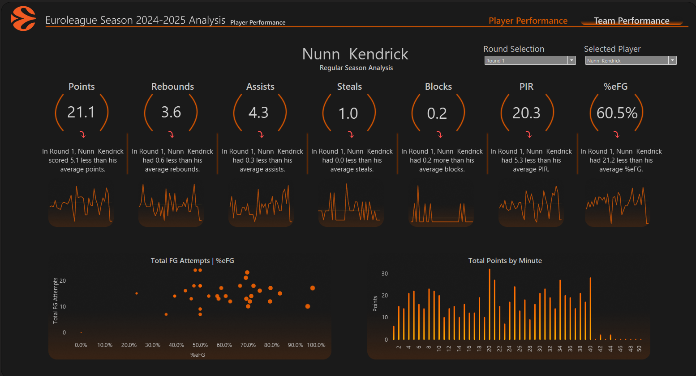
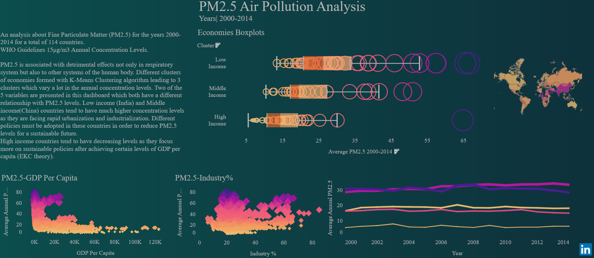
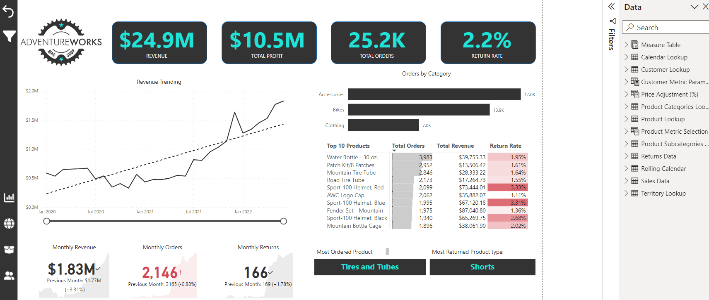
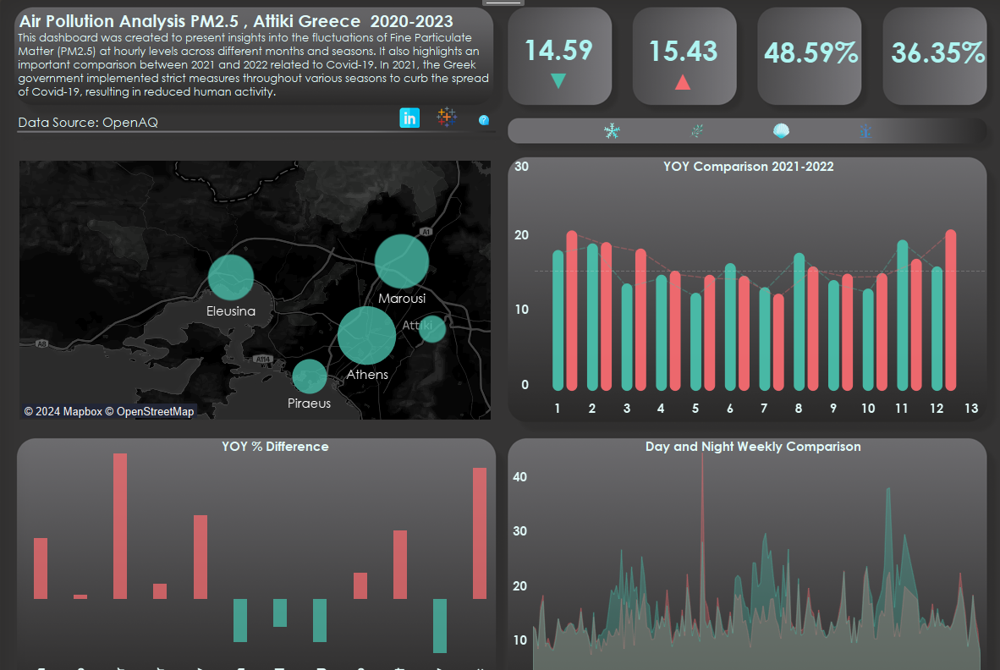

# Data Analyst

## Education 
- **MSc. in  Business Analytics** , National and Kapodistrian University of Athens, _Athens 2021-2023_

  -----
  
- **BA in Economics** , National and Kapodistrian University of Athens, _Athens 2014-2020_

  -----

## Work Experience
**Business Intelligence Specialist** , Circana, Athens _(April 2025 - Present)_
- Delivered weekly, monthly reports to high value clients like PepsiCo and Ferrero ensuring data integrity and a clear end-user experience while communicating actionable product insights.
- Optimized reports using Power Query (M Code) and DAX in Microsoft Excel, reducing update time, minimizing errors, and enhancing UI/UX for greater impact.

**Junior Business Analyst Intern** , Electrolux Group, Krakow  _(October 2023 - December 2023)_
- Utilized Microsoft Excel’s VBA to automate the manual task of SAP data extraction process leading to a
decrease in data extraction time from 10 minutes to 1 minute.

**Professor's Assistant** , National and Kapodistrian University of Athens  _(November 2021 - January 2022)_ 
- Lecture the undergraduate students about fundamental statistics and Microsoft Excel’s functions and
charts. 

## Projects
**Euroleague Team & Player Performance Analysis 2024-2025**

- Teams and Players Performance analysis for regular season including advanced metrics like PIR,eFG%. Data Collection, Data Cleaning, Data Modeling with Python and Dashboard creation with Tableau.

**Overview**

**Tableau Public Link :** [Euroleague_Project](https://public.tableau.com/app/profile/ioannis.chal/viz/EuroleagueSeason2024-2025PlayerTeamAnalysis/PlayerPerformanceAnalysis)

**Global Analysis of PM2.5 Main Drivers**

- Analyzed the impact of variables like GDP per capita, fossil fuels consumption, energy consumption, industry percentage to GDP and population/km2, for a total of 114 countries and created clusters of countries using K-means clustering. After K-means clustering implementation Panel Data Regression models utilized in Stata in order to indetify the impact of each variable in each cluster on PM2.5. Data collected through World Bank Data for the years 2000-2014. Python, R and Stata was the main tools for this project. Some of the code can be found here.
  
**Github Link:** [Project code-repository](https://github.com/Yannishal/Python_projects/tree/main/air_pollution_project)

Also a dashboard for the presentation of some basic statistics can be found here.

**Tableau Public Link :** [PM2.5 Summary Statistics](https://public.tableau.com/app/profile/ioannis.chal/viz/PM2_5AirPollutionAnalysis2000-2014/PM2_5AirPollution2000-2014)

**AdventureWorks Analysis**

- Analyzed key metrics for AdventureWorks shop. Identified the best customers and the profit per country and also the performance of each product and what customers characteristics affect the most the revenue of the company.

**Github Power BI repository :** [AdventureWorks Analysis](https://github.com/Yannishal/Power_BI_repository)

**Air Pollution Analysis Attiki,Greece and Covid-19 impact**

- Analyzed daily data from the OpenAQ API from 2020 to 2023 to examine the patterns of Fine Particulate Matter (PM2.5) across different times of day, seasons, and during the COVID-19 pandemic. Used Python and the Pandas library to collect, clean, and prepare the data for analysis in Tableau. The findings revealed that daytime air pollution levels were 70% lower than night-time levels, with winter consistently showing the highest pollution. During COVID-19 lockdowns, PM2.5 levels were 6% lower, particularly in winter, compared to non-lockdown periods. 

**Tableau Public Link:** [Athens PM2.5 Dashboard](https://public.tableau.com/app/profile/ioannis.chal/viz/AirPollutionAnalysisPM2_5AttikiGreece2020-2023/AirPollutionAnalysisAttikiGreece)
