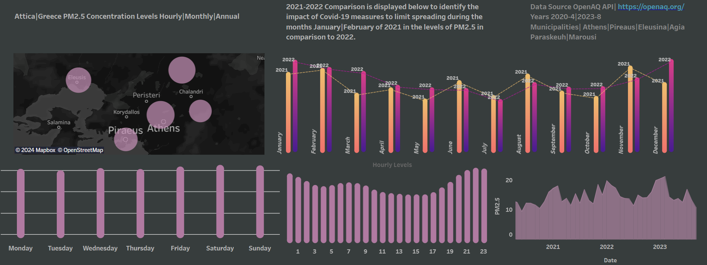

# Data Analyst

### Education 
- **MSc. in  Business Analytics** , National and Kapodistrian University of Athens, _Athens 2021-2023_

  -----
  
- **BA in Economics** , National and Kapodistrian University of Athens, _Athens 2014-2020_

  -----

### Work Experience
**Junior Business Analyst Intern** , Electrolux Group Krakow  _(October 2023 - December 2023)_
- Utilized Microsoft Excel’s VBA to automate the manual task of SAP data extraction process leading to a
decrease in data extraction time from 10 minutes to 1 minute.

**Professor's Assistant** , National and Kapodistrian University of Athens  _(November 2021 - January 2022)_ 
- Lecture the undergraduate students about fundamental statistics and Microsoft Excel’s functions and
charts. 

### Projects
**Global Analysis of PM2.5 Main Drivers**

- Analyzed the impact of variables like GDP per capita, fossil fuels consumption, energy consumption, industry percentage to GDP and population/km2, for a total of 114 countries and created clusters of countries using K-means clustering. After K-means clustering implementation Panel Data Regression models utilized in Stata in order to indetify the impact of each variable in each cluster on PM2.5. Data collected through World Bank Data for the years 2000-2014. Python, R and Stata was the main tools for this project. Some of the code can be found here.
[Project code-repository](https://github.com/Yannishal/Python_projects/tree/main/air_pollution_project)

Also a dashboard for the presentation of some basic statistics can be found here.

**Maven Market Analysis**

- Analyzed key metrics for Maven Market. Identified the best customers and the profit per country and also the performance of each product and what customers characteristics affect the most the revenue of the company.

**Athens-Greece PM2.5 Concentrations 2020-2023**

- An analysis with data collected through OPENAQ API with python in order to indetify the impact of covid restrictions. Data cleaning and manipulation implemented with python and pandas library to transform the data to hourly, daily, monthly and annual. The results are presented to the following dashboard in tableau public.

[Athens PM2.5 Dashboard](https://public.tableau.com/app/profile/ioannis.chal/viz/AtticaGRPM2_5AirPollution20204-20238/AttikiGRPM2_5)
